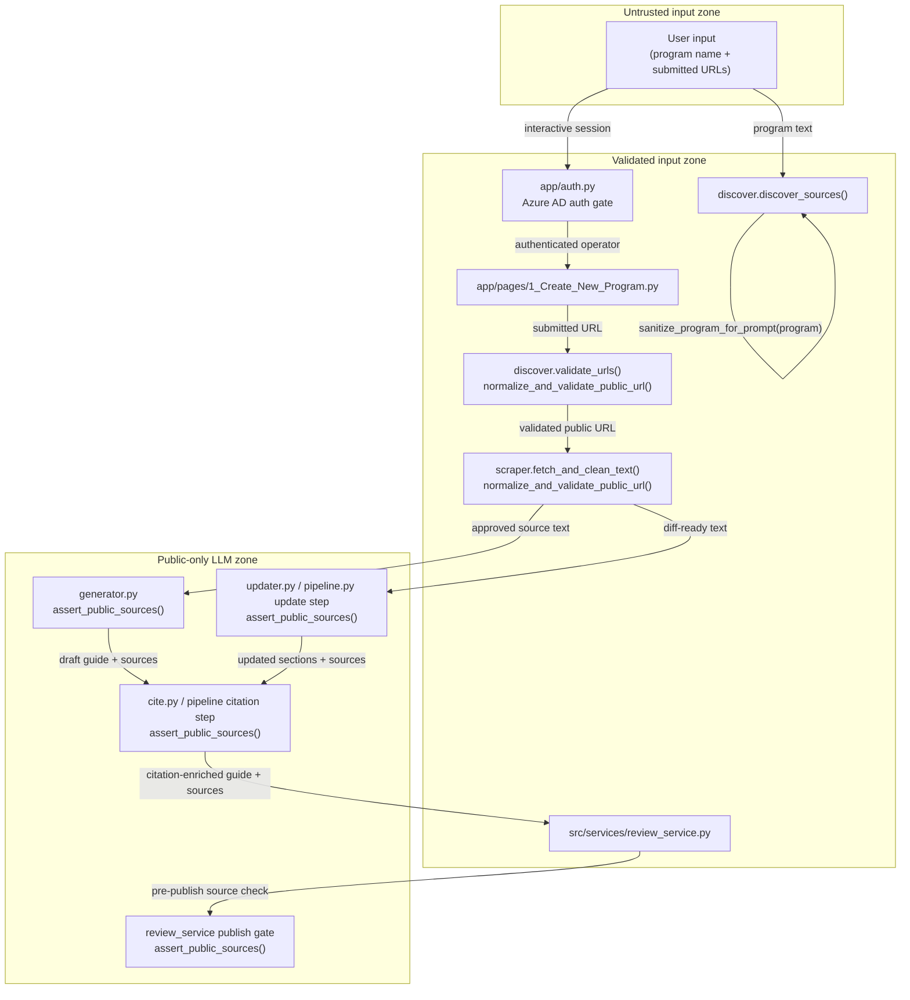
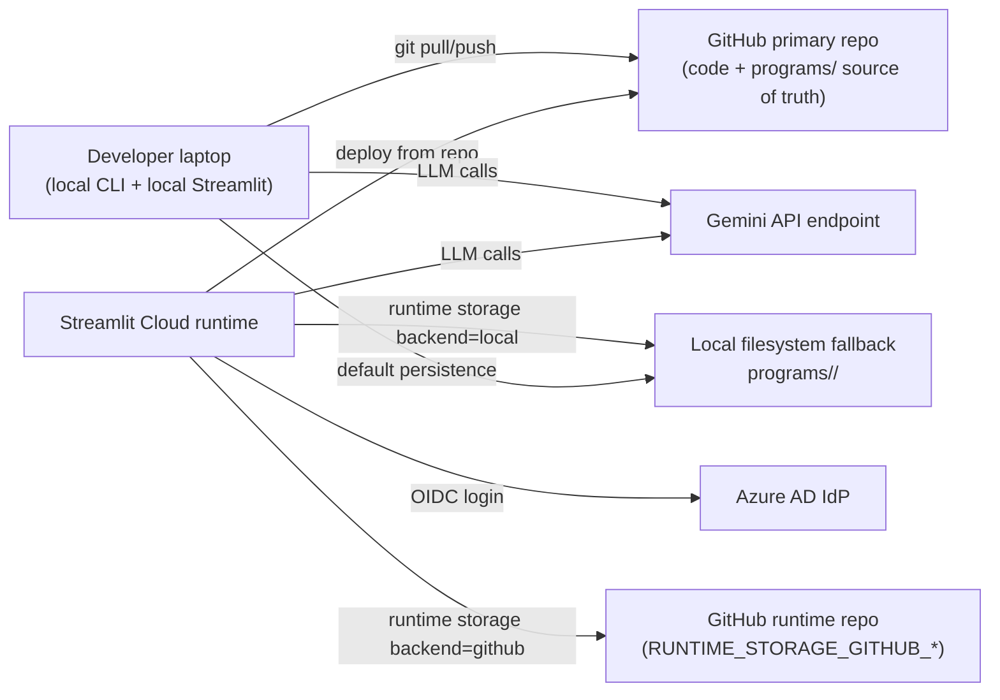

# Architecture

This document explains the runtime flow, trust boundaries, and deployment layout for the CI Sponsor Guide Tool.
It is intentionally split into focused diagrams so each view stays readable.

## Module & data flow

```mermaid
flowchart LR
  CLI["CLI entry points\nbootstrap.py / pipeline.py / collect_review.py"]
  UI["UI entry point\nstreamlit run app/main.py"]
  discover["discover.py"]
  scraper["scraper.py"]
  differ["differ.py"]
  updater["updater.py"]
  generator["generator.py"]
  cite["cite.py"]
  review["review.py + review_async.py + collect_review.py"]
  persist["src/services/persistence_service.py"]
  output["src/services/output_service.py"]
  files["programs/<slug>/* artifacts"]

  CLI -->|"program name / guide path / run options"| discover
  UI -->|"program name / approved links / operator actions"| discover
  discover -->|"candidate sources.json entries"| scraper
  scraper -->|"scraped text + snapshots + state.json"| differ
  differ -->|"diff_text + changed source set"| updater
  discover -->|"approved sources + program context"| generator
  updater -->|"updated guide.md sections"| cite
  generator -->|"first-draft guide.md"| cite
  cite -->|"guide.md + inline citations + evidence refs"| review
  review -->|"approved sources + approved draft"| persist
  persist -->|"guide.md / sources.json / state.json / review artifacts"| files
  persist -->|"normalized artifact payload"| output
  output -->|"md/docx/pdf + evidence artifacts"| files

  subgraph Legend
    l1["Rectangles = modules or services"]
    l2["Edge labels = payload crossing the boundary"]
    l3["files node = persisted artifacts under programs/<slug>/"]
  end
```



`bootstrap.py` starts a new program run from the CLI. It collects a program prompt, runs discovery, prepares a
review package, and coordinates first-draft generation after source approval.

`app/main.py` and `app/pages/*` provide the interactive Streamlit path for non-CLI users. The UI triggers the same
core workflows as the scripts while persisting artifacts under `programs/<slug>/`.

`discover.py` finds likely public source URLs for a program and prepares candidates for review. It is intentionally
Gemini-bound because it relies on Gemini native SDK search grounding and therefore does not use `src/utils/llm_client.py`.

`scraper.py` fetches and cleans source pages, producing normalized text snapshots for downstream comparison and
citation checks.

`differ.py` compares newly scraped source text with prior snapshots from `state.json` and emits focused change text
used for targeted guide updates.

`updater.py` applies model-driven edits only to sections affected by detected source changes, preserving unchanged
guide sections.

`generator.py` produces the initial sponsor guide draft from approved public sources when a program is first created.

`cite.py` adds or refreshes citations using approved source text and evidence alignment checks so references can be
traced back to scraped content.

`review.py`, `review_async.py`, `collect_review.py`, and `notify_review.py` handle synchronous and asynchronous source
review loops, including shared-folder workflows and optional reviewer notifications.

`src/services/persistence_service.py` abstracts runtime reads and writes for program artifacts, selecting local or
GitHub-backed storage based on environment configuration.

`src/services/output_service.py` generates user-facing output artifacts (`.md`, `.docx`, `.pdf`, and evidence files)
from the current guide and review context.

## Trust boundaries



All user-provided values are treated as untrusted until validated. URL normalization and allow-list checks run in
`discover.validate_urls()`, `scraper.fetch_and_clean_text()`, and UI submission handling in
`app/pages/1_Create_New_Program.py`.

Program-name prompt input is sanitized via `sanitize_program_for_prompt()` inside `discover.discover_sources()`. Any
code path that places program text into prompts should apply the same sanitizer first.

`assert_public_sources()` is required at every LLM handoff boundary, including generation, updating, citation, and the
review-service publish gate, so only public-classified sources can be used for model operations and release output.

`app/auth.py` acts as the authentication boundary for Streamlit UI sessions. CLI entry points remain explicit local
operator actions and are not behind the web auth gate.

## Deployment & storage



The tool is developed locally and typically deployed on Streamlit Cloud from the primary GitHub repository. The
primary repo remains the source of truth for code and committed `programs/` artifacts.

At runtime, persistence is selected by `RUNTIME_STORAGE_BACKEND`: GitHub runtime repository mode (via
`RUNTIME_STORAGE_GITHUB_*`) or local filesystem fallback under `programs/<slug>/`.

Azure AD protects interactive Streamlit sessions in hosted mode when auth is configured, while Gemini endpoints handle
model calls for generation, update, citation, and discovery (with discovery using Gemini-native grounded search).

## Entry points and when to use them

- `python3 bootstrap.py`: create a new program, discover sources, run review, and generate a first draft.
- `python3 pipeline.py`: run recurring update cycles for an existing program using saved `guide.md` and `sources.json`.
- `streamlit run app/main.py`: use the guided UI for source review, generation, update runs, and output downloads.

`python3 collect_review.py` is a supporting operational entry point for async review completion, not a primary
generation/update entry path.

## Environment variables

| Variable | Purpose |
| --- | --- |
| `GEMINI_API_KEY` / `LLM_API_KEY` | API credentials for model calls (`LLM_API_KEY` preferred for OpenAI-compatible client). |
| `LLM_PROVIDER` | Selects LLM provider behavior for OpenAI-compatible client pathways. |
| `LLM_BASE_URL` | Overrides OpenAI-compatible endpoint base URL (default targets Gemini-compatible endpoint). |
| `LLM_MODEL` | Overrides model name used by OpenAI-compatible client paths. |
| `LLM_MAX_INPUT_CHARS` | Caps prompt/input size to constrain token usage and prevent oversized requests. |
| `REVIEW_NOTIFY_WEBHOOK_URL` | Default webhook for async review notification events. |
| `RUNTIME_STORAGE_BACKEND` | Chooses persistence backend (`local` or `github`). |
| `RUNTIME_STORAGE_GITHUB_REPO` | Target runtime repository in `owner/repo` format. |
| `RUNTIME_STORAGE_GITHUB_TOKEN` | Token used to read/write runtime artifacts in the runtime repository. |
| `RUNTIME_STORAGE_GITHUB_BRANCH` | Branch used for runtime artifact storage in runtime repo mode. |
| `RUNTIME_STORAGE_GITHUB_PREFIX` | Path prefix inside runtime repo for stored program artifacts. |

## LLM provider smoke tests

Use smoke tests to verify `updater.update_guide()` runs end-to-end against live OpenAI-compatible providers by changing only env vars.

Run:

```bash
python3 -m pytest -m smoke tests/test_llm_provider_smoke.py
```

Gemini (OpenAI-compatible endpoint):

```bash
export LLM_API_KEY="your-gemini-key"
export LLM_BASE_URL="https://generativelanguage.googleapis.com/v1beta/openai/"
export LLM_MODEL="gemini-2.5-flash"
python3 -m pytest -m smoke tests/test_llm_provider_smoke.py
```

OpenAI:

```bash
export LLM_API_KEY="your-openai-key"
export LLM_BASE_URL="https://api.openai.com/v1"
export LLM_MODEL="gpt-4o-mini"
python3 -m pytest -m smoke tests/test_llm_provider_smoke.py
```

Anthropic via OpenAI-compatible bridge:

```bash
export LLM_API_KEY="your-anthropic-bridge-key"
export LLM_BASE_URL="https://<your-anthropic-openai-bridge>/v1"
export LLM_MODEL="<bridge-supported-model>"
python3 -m pytest -m smoke tests/test_llm_provider_smoke.py
```

The smoke suite intentionally targets the shared OpenAI-compatible client path used by `updater.py`. `discover.py` remains out of scope because it is Gemini-native grounding logic rather than the provider-agnostic OpenAI-compatible pathway.

## Keeping this doc fresh

- Update this file whenever a module is added or removed, or when module responsibilities change.
- Update this file whenever a new environment variable changes runtime behavior.
- Keep `README.md` linked to this file so architecture docs stay discoverable for operators and contributors.
