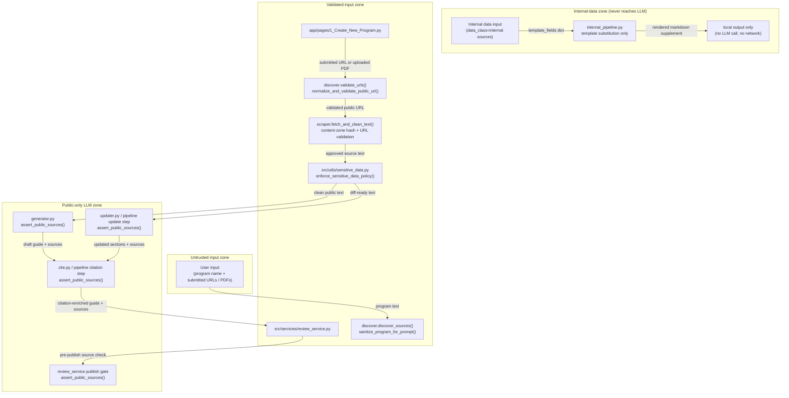
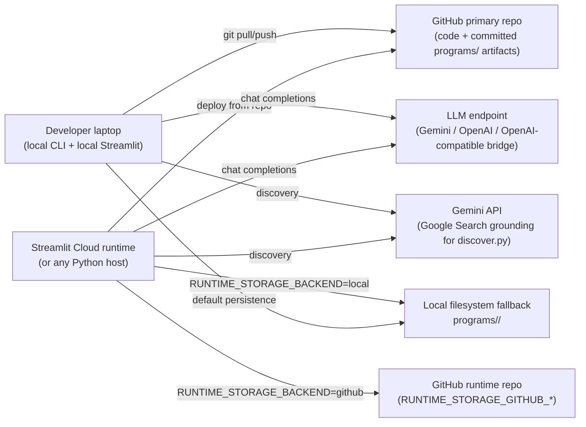

# Architecture

This document explains how the **CI Sponsor Guide Tool** works end to end: the modules, the data
that moves between them, the techniques used at each stage, and the trust/deployment boundaries.

It is written so that:

- A new developer can understand the entire pipeline without reading every file.
- A non-technical user can hand this doc plus the codebase to an AI agent and ask for changes with enough context for the agent to make safe, targeted edits.

If something here disagrees with the code, the code wins. Please open an issue (or update this file)
when behavior drifts.

## 1. Operating model

The tool has two distinct lifecycles for every grant program. Keep these in mind — almost all
modules and artifacts map back to one of them.

| Lifecycle              | When you run it                                          | Primary entry points                                                |
| ---------------------- | -------------------------------------------------------- | ------------------------------------------------------------------- |
| **One-time setup**     | When onboarding a new sponsor / funding opportunity.     | `bootstrap.py` (CLI) or `app/pages/1_Create_New_Program.py` + `2_Review_Sources.py` (UI) |
| **Weekly maintenance** | When sponsor pages may have changed since the last run.  | `pipeline.py` (CLI) or `app/pages/3_Run_Weekly_Update.py` (UI)      |

A separate, **template-only** lifecycle exists for confidential institutional data:

| Lifecycle              | When you run it                                                | Entry point                              |
| ---------------------- | -------------------------------------------------------------- | ---------------------------------------- |
| **Internal supplement**| Render internal/restricted data into a markdown supplement.    | `internal_pipeline.py`                   |

The internal pipeline performs **only local string substitution** (`string.Template`). It does not
import any LLM client and does not make any network call.

## 2. Filesystem layout per program

Every program lives under `programs/<slug>/`. The slug is derived from the program name via
`program_utils.make_slug()`. Knowing this layout is the fastest way to debug or extend the tool.

```text
programs/<slug>/
├── sources.json                 # Approved source list (committed)
├── guide.md                     # Baseline first-draft guide (committed)
├── state.json                   # Per-source content hashes + last_checked + extraction metadata
├── data/
│   ├── <SourceName>_latest.txt        # Last scraped text snapshot
│   └── <SourceName>_latest.meta.json  # Extraction metadata (method, char count, page count)
├── review/
│   ├── sources_pending.json     # Pre-approval review queue
│   ├── draft_guide.md           # Draft guide shown during review
│   └── uploads/                 # Operator-uploaded PDF sources
├── review_packages/             # Local copies of async shared-folder review bundles
└── output/
    ├── sponsor_guide_updated.md
    ├── sponsor_guide_updated.docx
    ├── sponsor_guide_updated.pdf
    ├── sponsor_guide_evidence.json                       # Citation evidence
    ├── sponsor_guide_updated_YYYYMMDD_HHMMSS.md          # Per-run history copy
    ├── sponsor_guide_updated_YYYYMMDD_HHMMSS.docx
    ├── sponsor_guide_updated_YYYYMMDD_HHMMSS.pdf
    └── sponsor_guide_evidence_YYYYMMDD_HHMMSS.json
```

What is committed vs. ignored is summarized in `programs/README.md`. The short version:

- **Commit**: `sources.json`, `guide.md`.
- **Do not commit**: everything under `state.json`, `data/`, `review/`, `review_packages/`, `output/`.

`internal_sources.json` (template-only internal data) is hard-blocked by `.gitignore` — never commit it.

## 3. Module & data flow


```mermaid
flowchart LR
  CLI["CLI entry points\nbootstrap.py / pipeline.py / collect_review.py\ninternal_pipeline.py"]
  UI["UI entry point\nstreamlit run app/main.py\n(portfolio dashboard + workflow pages)"]
  discover["discover.py\n(Gemini grounded search)"]
  scraper["scraper.py\n(content-zone hashing + extraction metadata)"]
  differ["differ.py\n(unified diff -> change blocks)"]
  updater["updater.py\n(targeted section rewrite)"]
  generator["generator.py\n(first-draft generation)"]
  cite["cite.py\n(claim-to-source mapping + evidence)"]
  weekly["weekly_update.py\n(banner + red highlight markup)"]
  review["review.py + review_async.py + collect_review.py"]
  persist["src/services/persistence_service.py\n(local + GitHub runtime storage)"]
  audit["src/services/audit_service.py\n(diff + citations + evidence map)"]
  exporters["src/exporters/\ndocx_export.py / pdf_export.py"]
  files["programs/<slug>/* artifacts"]
  internalFiles["output internal supplement\n(no LLM call)"]

  CLI -->|"program name / guide path / run options"| discover
  UI -->|"program name / approved links / operator actions"| discover
  discover -->|"candidate sources.json entries"| scraper
  scraper -->|"text + content-zone hash + state.json + data/<name>_latest.txt"| differ
  differ -->|"diff_text + changed source set"| updater
  discover -->|"approved sources + program context"| generator
  updater -->|"updated guide.md sections"| weekly
  weekly -->|"banner + highlighted markdown"| cite
  generator -->|"first-draft guide.md"| cite
  cite -->|"guide.md + inline citations + evidence list"| review
  review -->|"approved sources + approved draft"| persist
  persist -->|"guide.md / sources.json / state.json / review artifacts"| files
  persist -->|"md content"| exporters
  exporters -->|"docx/pdf artifacts"| files
  files -->|"baseline + updated + evidence"| audit
  CLI -->|"internal sources (data_class=internal)"| internalFiles
```

### 3.1 Module responsibilities

`bootstrap.py` — CLI driver for the **one-time setup** flow: discover sources, validate URLs,
generate a first draft, run interactive (or async shared-folder) review, and finalize approved
artifacts under `programs/<slug>/`.

`pipeline.py` — CLI driver for the **weekly maintenance** flow: scrape every approved source, diff
against the last snapshot, ask the LLM to rewrite affected guide sections, decorate the result with
the weekly-update banner and red highlights, optionally regenerate citations, and write timestamped
output artifacts.

`internal_pipeline.py` — Internal-data flow. Loads only `data_class="internal"` sources, performs
local `string.Template` substitution against each source's `template_fields`, and writes a
standalone markdown supplement. Does not import any LLM client, does not make network calls. This
is the **mandatory** path for any confidential institutional data.

`app/main.py` and `app/pages/*` — Streamlit UI. Same pipeline modules, exposed as a guided
workflow:

| Page                              | Role                                                                                    |
| --------------------------------- | --------------------------------------------------------------------------------------- |
| `0_Program_Dashboard.py`          | Portfolio dashboard (browse and select all `programs/<slug>/` workspaces).              |
| `1_Create_New_Program.py`         | Discover sources for a new program (or alternative-funding monitor).                    |
| `2_Review_Sources.py`             | Approve/reject/edit sources, generate first draft + citations, write outputs.           |
| `3_Run_Weekly_Update.py`          | Re-scrape approved sources, run the diff/update/citation flow, refresh outputs.         |
| `4_Outputs.py`                    | Preview and download `.md` / `.docx` / `.pdf` (latest plus timestamped history).        |
| `5_Audit_Evidence.py`             | Inspect guide diff, citation links, and evidence map (uses `audit_service`).            |

`discover.py` — Source discovery via Gemini's native SDK with Google Search grounding. It
intentionally **bypasses** the shared OpenAI-compatible client (`src/utils/llm_client.py`) because
it relies on Gemini-specific grounding tools. It also exposes the **Alternative Funding
Intelligence Monitor** that seeds and ranks foundation/corporate/international/pharma opportunities.

`scraper.py` — Fetch + clean source pages, with these techniques:

- HTML extraction via `BeautifulSoup`; PDF extraction via `pypdf` → `PyMuPDF` → optional OCR
  endpoint (`OCR_ENDPOINT`/`OCR_API_KEY`), in that fallback order.
- **Content-zone hashing**: before computing the SHA-256 fingerprint, the scraper strips
  `<nav>`, `<header>`, `<footer>`, ARIA `role` banners, and id/class noise such as
  `cookie`, `consent`, `gdpr`, `breadcrumb`, etc. Only the substantive content zone (`<main>` →
  `<article>` → fallback to whole-page text) feeds the hash. This eliminates almost all
  false-positive change detections from cosmetic page chrome.
- Per-source `extraction` metadata — `extraction_method` (`html`, `pypdf`, `pymupdf`, `ocr`,
  `html_fallback`), `character_count`, `page_count`, `content_type` — is written to `state.json`
  and `<source>_latest.meta.json`, and surfaces in citation evidence.
- Retries on `ConnectionError`, HTTP 429, and HTTP 503 with jittered exponential backoff
  capped by any `Retry-After` header.

`differ.py` — Compares the previous text snapshot to the new one with `difflib.unified_diff`,
groups output under `### Added/Modified Text` and `### Removed Text` headers, strips empty lines
to reduce noise, and handles the brand-new / fully-removed edge cases explicitly.

`updater.py` — LLM-driven targeted update. Builds a prompt of the form `[Current Guide] +
[Detected Changes]`, truncates to `LLM_MAX_INPUT_CHARS` if needed, and asks the model to return
the **complete updated markdown** while preserving formatting and avoiding hallucination. Also
exposes `classify_sections()` which asks the model which guide headings a scraped page relates to
(used when a source has no manually mapped sections).

`generator.py` — First-draft generation. Scrapes every approved source, allocates a per-source
character budget (`MAX_INPUT_CHARS / source_count`, floored at 20K), enforces sensitive-data
policy on each source excerpt, and asks the model to produce a guide containing the nine required
sections (`Executive Summary`, `Program Overview`, `Key Dates`, `Eligibility`, `Award Size & Budget`,
`How Proposals are Reviewed`, `Application Requirements`, `Tips for Successful Proposals`,
`Resources`). Missing required sections are surfaced as a `UserFacingError` so reviewers see them
before publication.

`cite.py` — Adds inline footnote citations and produces an evidence list. Detailed in the
[Audit log section](#5-audit-log-diffs-citations-and-evidence) below.

`weekly_update.py` — Deterministic post-LLM presentation layer (no model call). Strips any prior
generated banner/highlight markup, then:

- `summarize_source_changes()` derives short bullets from the structured `differ` output.
- `summarize_guide_changes()` falls back to bullets derived from the guide-text line diff if
  source bullets are empty.
- `highlight_changed_main_text()` runs `difflib.SequenceMatcher` between the previous and updated
  guide and wraps inserted/replaced lines in `<span style="color: #c1121f">` (preserving headings,
  bullets, blockquotes, and table cells).
- `build_update_banner()` prepends a `## Weekly Update` block guarded by HTML comment markers
  (`<!-- weekly-update-banner:start -->` / `:end -->`) so the next run can strip and rebuild it.

`review.py`, `review_async.py`, `collect_review.py`, `notify_review.py` — Synchronous interactive
review (CLI menu + UI buttons), async shared-folder review (`OneDrive` / `Teams` / any shared
path), reviewer notification webhooks, and post-approval collection back into the workspace.

`src/services/audit_service.py` — Builds the data shown on the **Audit Evidence** page: the
unified diff between `programs/<slug>/guide.md` (baseline) and
`programs/<slug>/output/sponsor_guide_updated.md` (updated), the inline citation links pulled out
of the updated markdown, and the evidence list loaded from `sponsor_guide_evidence.json`.

`src/services/persistence_service.py` — Switches between local filesystem and GitHub
runtime-repository storage based on `RUNTIME_STORAGE_BACKEND`. Implements `hydrate_program()`
(remote → local) and `persist_program()` / `persist_paths()` (local → remote) with retry, branch
self-creation, and an in-memory file-SHA cache to avoid extra GitHub round-trips.

`src/services/review_service.py` — Glue layer for the UI: lists programs, loads/saves review
state, runs `generate_first_draft()`, applies sanitization to LLM markdown, and orchestrates
finalization.

`src/exporters/docx_export.py` and `src/exporters/pdf_export.py` — Markdown → `.docx` / `.pdf`.
Extracted from `pipeline.py` so the same code is used by CLI and `review_service`. The PDF
exporter additionally renders the weekly-update red highlight spans.

`src/utils/source_policy.py` — Public-only safety helpers: `assert_public_sources()` enforces
`data_class="public"` at every LLM handoff; `normalize_and_validate_public_url()` enforces
HTTPS-only, rejects literal IPs, requires the standard port, and gates hosts on a
`.gov` / `.edu` / `config/trusted_domains.json` allowlist; `sanitize_program_for_prompt()`
removes prompt-injection markers from operator-supplied program text before it touches a prompt.

`src/utils/sensitive_data.py` — Pre-LLM scan for SSNs, student IDs, credit-card-like numbers,
private-data phrases (`protected health information`, `patient record`, `PII`, etc.). Default
behavior is `block`; `LLM_LOCAL_MODE=true` flips the default to `warn`. Public sponsor language
that merely *mentions* policy terms (`HIPAA`, `FERPA`, `CUI`, `ITAR`, `confidential`) does not
trigger the block.

## 4. End-to-end workflow

This section walks through the lifecycles in execution order. File names in **bold** mark
useful "where do I edit this?" anchors for vibe-coding agents.

### 4.1 One-time setup (new program)

1. **Discover candidate sources.**
   - `bootstrap.run_bootstrap()` calls `discover.discover_sources(program)`.
   - Program text is sanitized via `sanitize_program_for_prompt()` before it is interpolated
     into the discovery prompt (**`discover.py` → `DISCOVERY_PROMPT_TEMPLATE`**).
   - Gemini returns a JSON array of `{url, label, sections}`. `validate_urls()` then issues a
     `GET` to each URL, follows redirects, records final URL and content-type, and flags
     unreachable or duplicate entries.
   - `build_sources_json()` filters to reachable HTML pages and wraps them with
     `data_class="public"` so they are eligible for the LLM steps below.
2. **Generate a first-draft guide.**
   - `generator.generate_guide(sources, program)` scrapes each approved source and asks the
     model to produce all nine required sections (**`generator.py` → `SYSTEM_PROMPT` /
     `REQUIRED_GUIDE_SECTIONS`**).
   - The draft, plus a copy of the proposed source list, is staged under
     `programs/<slug>/review/`.
3. **Reviewer approves the source list.**
   - Synchronous: `review.interactive_review()` exposes a CLI menu (approve / reject / edit /
     add link / finish early). Newly added URLs are validated through
     `normalize_and_validate_public_url()` and re-scraped before approval.
   - Asynchronous: `review_async.create_review_package()` packages
     `sources_pending.json`, `draft_guide.md`, `manifest.json` into a shared folder. Reviewers
     edit `manifest.json` to `approved`, then `collect_review.py` (optionally with `--watch`)
     pulls the approved set back into the workspace. `notify_review.py` can fire a webhook
     when the package is published.
4. **Finalize approved artifacts.**
   - `review.finalize()` writes `programs/<slug>/sources.json` and `programs/<slug>/guide.md`.
   - The same path runs through the citation pass (described below) and writes the first
     output artifacts under `programs/<slug>/output/` so reviewers can preview/download
     immediately — there is no need to wait for a weekly update.

### 4.2 Weekly maintenance (for existing program)

`pipeline.run_pipeline()` is the canonical implementation. The Streamlit Weekly Update page calls
the same module.

1. **Load inputs.**
   - `load_sources()` reads `sources.json` and validates `data_class="public"`.
   - `read_guide()` accepts `.md`, `.txt`, or `.docx` (converted via `mammoth`). The Streamlit
     UI prefers the latest `output/sponsor_guide_updated.md` over `guide.md`, falling back to
     `guide.md` only on the very first weekly run.
   - `weekly_update.strip_weekly_update_markup()` removes any prior banner / red highlights
     before the LLM sees the guide.
2. **Scrape & detect change per source.**
   - `scraper.check_for_updates_from_source()` fetches the source, extracts the **content
     zone** (see [§3 scraper](#31-module-responsibilities)), computes a SHA-256 hash, and
     compares it to `state.json`.
   - Unchanged: `last_checked` and `extraction` are refreshed; nothing else happens.
   - Changed: the new text is written to `data/<safe_name>_latest.txt` (and metadata to the
     sidecar `.meta.json`), and `state.json` is updated atomically under a file lock.
3. **Diff every changed source.**
   - `differ.extract_changes(old_text, new_text)` returns the structured "Added/Modified" and
     "Removed" blocks. If a source has no manually mapped sections, `updater.classify_sections()`
     asks the model which guide headings the new page relates to.
4. **Targeted LLM update.**
   - `pipeline.run_pipeline()` concatenates per-source diffs into a single combined block (one
     `## Source: <name>` header per changed source).
   - `assert_public_sources()` is re-checked, sensitive-data policy is enforced on each diff
     block, and `updater.update_guide()` returns the rewritten markdown.
5. **Decorate as a weekly update.**
   - `weekly_update.decorate_weekly_update()` adds the top banner (with bullets derived from
     the structured source diffs first, falling back to a guide-text line diff) and wraps
     changed lines in red highlight spans.
6. **Refresh citations** (default `--with-citations`).
   - For each source, the snapshot text is loaded from `data/`. If a snapshot is missing
     (first run, or a freshly added source), the scraper is re-invoked to obtain text on the
     fly. Citation generation is detailed in §5.
7. **Write outputs.**
   - `sponsor_guide_updated.md`, `.docx`, `.pdf` are written, then duplicated as
     `*_YYYYMMDD_HHMMSS.*` history copies. `sponsor_guide_evidence.json` and a timestamped
     copy are written when the citation pass produced any accepted entries.

CLI flags worth knowing:

- `--no-citations` — skip the citation pass entirely.
- `--refresh-citations` — run the citation pass even if no source changed.
- `--refresh-citations-only` — skip scrape+diff+update; only regenerate citations from existing
  `data/` snapshots.

### 4.3 Internal-data supplement (no LLM)

`internal_pipeline.run_internal_pipeline()`:

1. Reads `internal_sources.json` and validates `data_class="internal"` plus a `template_fields`
   dict on every entry.
2. Renders each source through Python `string.Template.safe_substitute` against the default
   section template (or a per-source `section_template` override).
3. Concatenates rendered sections, optionally appends them to an existing guide, and writes
   `programs/<slug>/output/sponsor_guide_internal_supplement.md`.

There is no LLM client import on this path. Adding one would defeat the guarantee.

## 5. Audit log: diffs, citations, and evidence

The "audit log" surface in this tool is not a single file — it is a set of artifacts produced
deterministically at every weekly run plus a Streamlit page that joins them. This section
explains exactly what is compared, against what, and how.

### 5.1 What "weekly update" compares to what

There are **two independent diffs** per run, with different inputs and different purposes:

| Diff             | Inputs                                                                           | Purpose                                                                  | Implemented in                       |
| ---------------- | -------------------------------------------------------------------------------- | ------------------------------------------------------------------------ | ------------------------------------ |
| **Source diff**  | `data/<source>_latest.txt` *(previous run)* vs. fresh content-zone scrape *(this run)* | Decides whether the LLM update step runs at all, and feeds the diff text the model rewrites from. | `scraper.py` + `differ.py`           |
| **Guide diff**   | Previous generated guide *(stripped of weekly markup)* vs. updated markdown returned by the LLM | Drives the banner bullets and red-highlight markup; also drives the Audit Evidence page diff. | `weekly_update.py` + `audit_service.py` |

Two important rules of thumb:

- **The "previous guide" is the previous *generated* guide, not the original baseline.** In the
  Streamlit UI, the Weekly Update page picks the latest `output/sponsor_guide_updated.md` and
  only falls back to `guide.md` on the first weekly run. Both the LLM update step and the red
  highlighting compare against this previous generated guide, so each weekly run shows what
  changed *since the previous weekly run*.
- **Audit Evidence (Streamlit page 5) compares against the original baseline** (`guide.md`), not
  the previous weekly output. This gives you a "since first publication" view of how the guide
  has drifted, which is exactly what an auditor wants. See `audit_service.load_audit_data()`.

### 5.2 How the source diff is computed (change detection)

1. `scraper.fetch_source_payload_from_source()` fetches the URL or uploaded PDF. For HTML, it
   computes both a full-page text and a **content-zone text** that strips noise tags / IDs /
   classes (nav, header, footer, cookie banners, breadcrumbs, etc.).
2. `scraper.generate_hash(content_zone_text)` produces a SHA-256 hex digest.
3. The new digest is compared against `state.json[<name>].hash`:
   - Equal → log `status=no_change`, refresh `last_checked` and `extraction`, return `False`.
   - Different (or missing) → write the **full** text to `data/<safe_name>_latest.txt`, write
     metadata to `<safe_name>_latest.meta.json`, and update `state.json` atomically.
4. When a source is flagged as changed, `differ.extract_changes(old_text, new_text)` produces a
   compact diff:

```text
### Added/Modified Text

  + <inserted line 1>
  + <inserted line 2>

### Removed Text

  - <removed line 1>
```

Edge cases are handled explicitly: empty old → "Entirely New Content" with the full new text;
empty new → "Content Removed" with the full old text; both empty → "nothing to compare".

`pipeline.run_pipeline()` concatenates per-source diffs into one block that opens with
`## Source: <name>` and (when known) `Relevant guide sections: ...`. This block is what
`updater.update_guide()` sends to the LLM together with the current guide.

### 5.3 How the guide diff and weekly markup work

After the LLM returns the rewritten markdown:

1. `weekly_update.strip_weekly_update_markup()` first removes any prior banner and red spans
   from both the previous guide and the updated guide. This keeps subsequent diffs focused on
   real content changes, not on markup churn.
2. `weekly_update.summarize_source_changes(source_diffs)` extracts up to six concise bullets
   from the structured `differ` output. If that produces nothing, it falls back to
   `summarize_guide_changes()`, which runs `difflib.SequenceMatcher` over the cleaned previous
   vs. updated guide line lists.
3. `weekly_update.highlight_changed_main_text()` runs another `SequenceMatcher` pass and wraps
   inserted / replaced lines in `<span style="color: #c1121f;">…</span>`, with special handling
   for headings, bullets, blockquotes, and table cells so the markdown still renders cleanly.
   Deletions cannot be highlighted in the body (the text is gone), so the banner mentions them
   explicitly.
4. `weekly_update.build_update_banner()` emits a `## Weekly Update` section guarded by
   `<!-- weekly-update-banner:start -->` / `:end -->` markers, listing the run date, changed
   source labels, and bullets.

The Streamlit `5_Audit_Evidence.py` page produces a third, simpler view: a `unified_diff` between
the baseline (`guide.md`) and the latest updated markdown (`output/sponsor_guide_updated.md`).
This is built by `audit_service.load_audit_data()` and is not influenced by the weekly markup —
the audit page is meant for "what has changed since publication", not "what changed this run".

### 5.4 How citations are generated

Citations are produced by `cite.add_citations()` and run at the end of both the first-draft and
weekly-update flows. The high-level guarantee is:

> A claim line in the guide receives a citation **only if** an approved source's scraped text
> shares enough vocabulary with the claim to clear the lexical-overlap threshold.

This is intentionally a guardrail against LLM hallucination, not a semantic-similarity score.

#### Step-by-step

1. **Extract candidate claim lines** (`_extract_claim_lines`).
   - Skip blank lines, code fences, footnote definitions, table separators, lines inside the
     weekly-update banner, lines under a `References` / `Sources` / `Resources` heading, and
     bare URLs.
   - Strip leading bullet markers, prior citation markers (`[1]`, `[[1]]`, `[^S1]`, …), and
     light HTML.
   - Drop anything shorter than 35 characters.
   - Tag each survivor with its line index `L<idx>`.
2. **Pick a relevant excerpt per source** (`_select_relevant_source_excerpt`).
   - For sources shorter than ~2200 chars, send the whole text.
   - Otherwise, split into 900-char chunks, score each chunk by token overlap with the union of
     all claim tokens, and stitch the top three chunks together (separated by `...`) up to the
     2200-char budget.
   - This is what lets very long PDF NOFOs still produce useful evidence — you don't lose
     eligibility/budget sections because the model only saw page 1.
3. **Send a strict-JSON mapping prompt** (`_build_prompt`).
   - Asks the model to map each `id: "L<idx>"` to up to two source names from the approved
     list, using **only** names from that list, returning JSON only.
   - System prompt: `"Return strict JSON only."`. Temperature `0.0`.
4. **Validate every mapping locally** (`_tokenize` + overlap check).
   - For each claim/source pair the model proposes, compute the lexical-overlap ratio:
     `|tokens(claim) ∩ tokens(source_text)| / max(1, |tokens(claim)|)`.
   - Tokens are lowercased alphanumeric runs of length ≥3.
   - Reject anything below `min_overlap` (default `0.06`). This filters cases where the model
     picks a plausibly-related source that doesn't actually back the specific claim.
5. **Build text-fragment deep links** (`_best_excerpt_and_link`).
   - For each accepted citation, find the longest claim token that appears in the source text,
     pull a 300-char window around it, and emit a browser text-fragment URL of the form
     `<source_url>#:~:text=<urlencoded excerpt>`. Browsers that support text fragments
     (Chrome / Edge / current Safari) jump straight to the highlighted passage.
6. **Rewrite the markdown.**
   - Strip prior citation markers from the line, then append `[[N]](deep_link)` markers (one
     per accepted source, capped at two).
   - Drop any pre-existing `## Sources` / `## References` raw URL list.
   - Append a single `## References` block at the bottom with `\[N\]: [Source Name](deep_link)`
     entries, one per source actually cited.
7. **Emit the evidence list.**
   - Each item is a JSON object the audit page consumes:

```json
{
  "line_id": "L42",
  "claim": "Eligible institutions must not have received more than $6 million per year in NIH support.",
  "sources": ["NIH_R15_Main_Page"],
  "urls": ["https://grants.nih.gov/grants/funding/r15.htm"],
  "source_details": [
    {
      "name": "NIH_R15_Main_Page",
      "url": "https://grants.nih.gov/grants/funding/r15.htm",
      "deep_link": "https://grants.nih.gov/grants/funding/r15.htm#:~:text=...",
      "evidence_excerpt": "...not received more than $6 million per year in NIH support...",
      "overlap_score": 0.83,
      "extraction": {"extraction_method": "html", "character_count": 24122, "page_count": null}
    }
  ],
  "overlap_scores": {"NIH_R15_Main_Page": 0.83}
}
```

The full file is written to `programs/<slug>/output/sponsor_guide_evidence.json` (plus a
timestamped copy). On the **Audit Evidence** Streamlit page this becomes a sortable table; in
the markdown guide it becomes the bracketed footnote markers and the `## References` block.

#### When citations are skipped

`cite.add_citations()` returns the original markdown (with no evidence) when:

- The LLM client is unavailable (`EnvironmentError`).
- No source has a non-empty snapshot (e.g. all scrapes failed).
- No claim line passed the 35-character / structural filters.
- The model returned non-JSON or a non-list payload.
- Every proposed mapping fell below `min_overlap`.

Each of these emits a `event=citation_skipped reason=...` log line so you can diagnose from
`logs/pipeline.log`.

### 5.5 Audit Evidence page (Streamlit)

`app/pages/5_Audit_Evidence.py` calls `audit_service.load_audit_data(slug)` which produces:

- `diff_text` — `unified_diff(baseline guide.md, output/sponsor_guide_updated.md)` formatted
  as a single string. Empty if no weekly update has run yet.
- `citations` — a list of `{id, url}` extracted from the updated markdown via the regex
  `\[(?:\[(\d+)\]|(\d+))\]\((https?://[^)\s]+)\)` (matches both `[1](url)` and `[[1]](url)`).
- `evidence` — the full contents of `sponsor_guide_evidence.json`, used to drive the evidence
  table and an expandable raw-JSON view.
- `remote_program_url` — when GitHub runtime persistence is enabled, a clickable link to the
  program's folder in the runtime repo.

This page is the human-facing "audit log". For an auditable trail across runs, look at the
timestamped copies in `programs/<slug>/output/` (`sponsor_guide_updated_YYYYMMDD_HHMMSS.*` and
`sponsor_guide_evidence_YYYYMMDD_HHMMSS.json`).

## 6. Trust boundaries


```mermaid
flowchart TB
  userIn["User input\n(program name + submitted URLs / PDFs)"]
  internalIn["Internal data input\n(data_class=internal sources)"]
  uiCreate["app/pages/1_Create_New_Program.py"]
  discoverFn["discover.discover_sources()\nsanitize_program_for_prompt()"]
  discoverUrl["discover.validate_urls()\nnormalize_and_validate_public_url()"]
  scraperFn["scraper.fetch_and_clean_text()\ncontent-zone hash + URL validation"]
  reviewSvc["src/services/review_service.py"]
  sensitive["src/utils/sensitive_data.py\nenforce_sensitive_data_policy()"]
  gen["generator.py\nassert_public_sources()"]
  upd["updater.py / pipeline update step\nassert_public_sources()"]
  cite["cite.py / pipeline citation step\nassert_public_sources()"]
  publish["review_service publish gate\nassert_public_sources()"]
  internalPipeline["internal_pipeline.py\ntemplate substitution only"]
  localOut["local output only\n(no LLM call, no network)"]

  subgraph Untrusted["Untrusted input zone"]
    userIn
  end

  subgraph InternalZone["Internal-data zone (never reaches LLM)"]
    internalIn
    internalPipeline
    localOut
  end

  subgraph Validated["Validated input zone"]
    uiCreate
    discoverFn
    discoverUrl
    scraperFn
    reviewSvc
    sensitive
  end

  subgraph PublicOnly["Public-only LLM zone"]
    gen
    upd
    cite
    publish
  end

  internalIn -->|"template_fields dict"| internalPipeline
  internalPipeline -->|"rendered markdown supplement"| localOut

  userIn -->|"program text"| discoverFn
  uiCreate -->|"submitted URL or uploaded PDF"| discoverUrl
  discoverUrl -->|"validated public URL"| scraperFn
  scraperFn -->|"approved source text"| sensitive
  sensitive -->|"clean public text"| gen
  sensitive -->|"diff-ready text"| upd
  gen -->|"draft guide + sources"| cite
  upd -->|"updated sections + sources"| cite
  cite -->|"citation-enriched guide + sources"| reviewSvc
  reviewSvc -->|"pre-publish source check"| publish
```

Key invariants:

- **Untrusted → Validated**: every URL passes `normalize_and_validate_public_url()`, which
  enforces `https://`, rejects literal IPs / non-standard ports / userinfo, and gates the host
  on `.gov` / `.edu` / `config/trusted_domains.json`. Operator-supplied program text passes
  `sanitize_program_for_prompt()` to strip newlines, control characters, and prompt-injection
  markers (`system:`, `ignore previous instructions`, `<|...|>`, etc.).
- **Validated → Public-only LLM**: `assert_public_sources()` runs at every LLM handoff
  (generation, update, citation, publish gate). Anything not marked `data_class="public"` is
  rejected.
- **Sensitive-data screening**: `enforce_sensitive_data_policy()` runs on prompts and source
  excerpts before they hit the LLM. Default behavior is `block`; flip with
  `SENSITIVE_DATA_POLICY=warn|off`. `LLM_LOCAL_MODE=true` switches the default to `warn`
  because text never leaves the host.
- **Internal-data zone**: `internal_pipeline.py` cannot reach the LLM — it imports neither
  `llm_client` nor `requests` and only writes to local disk. This is the boundary that keeps
  confidential institutional data isolated.

## 7. Deployment & storage


```mermaid
flowchart LR
  dev["Developer laptop\n(local CLI + local Streamlit)"]
  cloud["Streamlit Cloud runtime\n(or any Python host)"]
  llm["LLM endpoint\n(Gemini / OpenAI / OpenAI-compatible bridge)"]
  search["Gemini API\n(Google Search grounding for discover.py)"]
  ghMain["GitHub primary repo\n(code + committed programs/ artifacts)"]
  ghRuntime["GitHub runtime repo\n(RUNTIME_STORAGE_GITHUB_*)"]
  localFs["Local filesystem fallback\nprograms/<slug>/"]

  dev -->|"git pull/push"| ghMain
  cloud -->|"deploy from repo"| ghMain
  dev -->|"chat completions"| llm
  cloud -->|"chat completions"| llm
  dev -->|"discovery"| search
  cloud -->|"discovery"| search
  cloud -->|"RUNTIME_STORAGE_BACKEND=github"| ghRuntime
  cloud -->|"RUNTIME_STORAGE_BACKEND=local"| localFs
  dev -->|"default persistence"| localFs
```

- **Code source of truth**: the primary GitHub repository.
- **Runtime persistence**:
  - `RUNTIME_STORAGE_BACKEND=local` (default) — everything stays in the container/laptop's
    `programs/<slug>/` directory. Cloud restarts wipe this.
  - `RUNTIME_STORAGE_BACKEND=github` — `persistence_service.py` syncs each program's
    files to a separate runtime repository on the configured branch and prefix. This is the
    recommended setting for hosted deployments because it survives cold starts and gives you a
    durable audit trail of artifact changes via Git history.
- **LLM endpoints**:
  - All "regular" model calls (generation, update, citation, section classification) go through
    the OpenAI-compatible client in `src/utils/llm_client.py`, configurable via `LLM_API_KEY`,
    `LLM_BASE_URL`, `LLM_MODEL`. Default endpoint is Gemini's OpenAI-compatible URL.
  - `discover.py` is the only module that uses Gemini natively; it requires `GEMINI_API_KEY`
    and depends on Gemini's `GoogleSearch` grounding tool.

## 8. Entry points and when to use them

| Command                                                                                   | Use it when                                                                                          |
| ----------------------------------------------------------------------------------------- | ---------------------------------------------------------------------------------------------------- |
| `python3 bootstrap.py "<program name>"`                                                   | Onboarding a brand-new program: discover sources, generate first draft, run review, finalize.       |
| `python3 bootstrap.py "<program name>" --async-review --shared-review-dir <path>`         | Same as above but stage the review package in a shared folder for async approval.                   |
| `python3 collect_review.py "<program name>" --shared-review-dir <path>`                   | Pull approved async review back into the workspace. Add `--watch --interval-seconds 300` to poll.    |
| `python3 pipeline.py programs/<slug>/output/sponsor_guide_updated.md --sources programs/<slug>/sources.json` | Recurring weekly update for an existing program.                                                     |
| `python3 pipeline.py ... --refresh-citations-only`                                        | Regenerate citations from existing snapshots without scraping or LLM rewriting.                      |
| `python3 internal_pipeline.py --sources internal_sources.json --guide programs/<slug>/guide.md --output programs/<slug>/output_internal` | Render internal/confidential data using template substitution only. No LLM call.                     |
| `streamlit run app/main.py`                                                               | Use the guided UI for any of the workflows above. Same artifacts under `programs/<slug>/`.           |

Operationally, the Streamlit pages map 1:1 to lifecycle steps:

- **Step 1 (Create New Program)** ↔ `bootstrap.py`'s discover + validate steps.
- **Step 2 (Review Sources)** ↔ `bootstrap.py`'s review + finalize steps + first-draft generation.
- **Step 3 (Run Weekly Update)** ↔ `pipeline.py`.
- **Step 4 (Outputs)** ↔ reads `programs/<slug>/output/`.
- **Step 5 (Audit Evidence)** ↔ `audit_service.load_audit_data()`.

## 9. Environment variables

| Variable                          | Purpose                                                                                                  |
| --------------------------------- | -------------------------------------------------------------------------------------------------------- |
| `LLM_API_KEY`                     | Preferred API key for the OpenAI-compatible LLM client (Gemini, OpenAI, Anthropic-via-bridge, …).        |
| `GEMINI_API_KEY`                  | Required for `discover.py` (uses native Gemini grounding). Also accepted as a fallback for `LLM_API_KEY`.|
| `LLM_PROVIDER`                    | Optional informational provider label.                                                                   |
| `LLM_BASE_URL`                    | Override the OpenAI-compatible endpoint base URL (default targets Gemini-compatible endpoint).           |
| `LLM_MODEL`                       | Override the default chat model for the OpenAI-compatible client (default `gemini-2.5-flash`).           |
| `LLM_MAX_INPUT_CHARS`             | Cap on prompt+input size for `generator.py` and `updater.py`. Default 200,000.                           |
| `LLM_LOCAL_MODE`                  | `true` flips the sensitive-data policy default from `block` to `warn`.                                   |
| `SENSITIVE_DATA_POLICY`           | `block` / `warn` / `off`. Explicit override of the LLM-handoff sensitive-data check.                     |
| `OCR_ENDPOINT` / `OCR_API_KEY`    | Optional OCR fallback used only when `pypdf` and `PyMuPDF` both fail to extract PDF text.                |
| `REVIEW_NOTIFY_WEBHOOK_URL`       | Default webhook for async-review notifications (Teams/Slack/generic JSON).                               |
| `RUNTIME_STORAGE_BACKEND`         | `local` (default) or `github`.                                                                           |
| `RUNTIME_STORAGE_GITHUB_REPO`     | `owner/repo` of the runtime repository when `RUNTIME_STORAGE_BACKEND=github`.                            |
| `RUNTIME_STORAGE_GITHUB_TOKEN`    | PAT with `Contents:write` scope for the runtime repo. Set in cloud secrets, not committed.               |
| `RUNTIME_STORAGE_GITHUB_BRANCH`   | Branch used for runtime artifacts (default `runtime-data`; auto-created from default branch).           |
| `RUNTIME_STORAGE_GITHUB_PREFIX`   | Path prefix inside the runtime repo (default `runtime/programs`).                                        |

`config/trusted_domains.json` is a config file, not an environment variable, but conceptually
plays the same role: it defines the foundation/.org allowlist that supplements `.gov` / `.edu`
for `normalize_and_validate_public_url()`. Edit this file to add or remove trusted hosts.

## 10. Where to change behavior (vibe-coding pointers)

If a non-technical user (or an AI agent acting on their behalf) wants to tweak something, here is
the short list of "edit this file" pointers. These are the highest-leverage spots; almost every
behavior change falls into one of these.

| You want to…                                                  | Edit this                                                                                       |
| ------------------------------------------------------------- | ----------------------------------------------------------------------------------------------- |
| Change the discovery prompt (what we ask Gemini to find)      | `discover.py` → `DISCOVERY_PROMPT_TEMPLATE`                                                     |
| Change the required sections in a generated guide             | `generator.py` → `REQUIRED_GUIDE_SECTIONS` and `SYSTEM_PROMPT`                                  |
| Change the targeted-update system prompt                      | `updater.py` → `SYSTEM_PROMPT`                                                                  |
| Adjust the noise-stripping for content-zone hashing           | `scraper.py` → `_extract_content_zone()` (`_NOISE_TAGS`, `_NOISE_ROLES`, `_NOISE_IDS`, `_NOISE_CLASSES`) |
| Change diff formatting / what counts as a meaningful change   | `differ.py` → `extract_changes()`                                                               |
| Change the lexical-overlap threshold for citations            | `cite.py` → `add_citations(min_overlap=...)` default                                            |
| Change citation candidate filtering (length, headings, etc.)  | `cite.py` → `_extract_claim_lines()`                                                            |
| Change weekly-update banner copy / red highlight color        | `weekly_update.py` → `HIGHLIGHT_COLOR`, `build_update_banner()`                                 |
| Change which LLM/provider/model is used                       | `.env` → `LLM_API_KEY`, `LLM_BASE_URL`, `LLM_MODEL`; for discovery, `GEMINI_API_KEY`            |
| Add a new trusted foundation/.org host                        | `config/trusted_domains.json` (`foundation_domains`)                                            |
| Adjust required source classification (public vs internal)    | `src/utils/source_policy.py` → `assert_public_sources()`                                        |
| Tune sensitive-data patterns                                  | `src/utils/sensitive_data.py`                                                                   |
| Add a new Streamlit page or tweak chrome                      | `app/pages/*.py`, `app/components/shell.py`                                                     |
| Change how docx/pdf exports look                              | `src/exporters/docx_export.py`, `src/exporters/pdf_export.py`                                   |
| Change runtime persistence (local vs GitHub)                  | `.env` → `RUNTIME_STORAGE_BACKEND` and `RUNTIME_STORAGE_GITHUB_*`                               |

When asking an agent to make a change, prefer phrasing like *"Edit `cite.py` to lower the
default `min_overlap` to 0.04 and update `tests/test_cite.py` accordingly"* over *"Make
citations more permissive"* — it gives the agent a single concrete entry point.

## 11. LLM provider smoke tests

Smoke tests verify that `updater.update_guide()` runs end-to-end against any OpenAI-compatible
provider by changing only environment variables.

```bash
python3 -m pytest -m smoke tests/test_llm_provider_smoke.py
```

Gemini (OpenAI-compatible endpoint):

```bash
export LLM_API_KEY="your-gemini-key"
export LLM_BASE_URL="https://generativelanguage.googleapis.com/v1beta/openai/"
export LLM_MODEL="gemini-2.5-flash"
python3 -m pytest -m smoke tests/test_llm_provider_smoke.py
```

OpenAI:

```bash
export LLM_API_KEY="your-openai-key"
export LLM_BASE_URL="https://api.openai.com/v1"
export LLM_MODEL="gpt-4o-mini"
python3 -m pytest -m smoke tests/test_llm_provider_smoke.py
```

Anthropic via OpenAI-compatible bridge:

```bash
export LLM_API_KEY="your-anthropic-bridge-key"
export LLM_BASE_URL="https://<your-anthropic-openai-bridge>/v1"
export LLM_MODEL="<bridge-supported-model>"
python3 -m pytest -m smoke tests/test_llm_provider_smoke.py
```

`discover.py` is intentionally excluded from these smoke tests because it depends on Gemini's
native grounding tools rather than the OpenAI-compatible chat-completions surface.

## 12. Keeping this doc fresh

- Update this file whenever a module is added or removed, or when a module's responsibilities
  change.
- Update this file whenever a new environment variable changes runtime behavior.
- Update §5 whenever the diff inputs, citation thresholds, evidence schema, or audit page
  contents change — that section is what auditors rely on.
- Update §10 ("where to change behavior") whenever a high-leverage knob moves to a new file or
  is renamed. This table is what a vibe-coding agent will reach for first.
- Keep `README.md` linked to this file so architecture docs stay discoverable.
